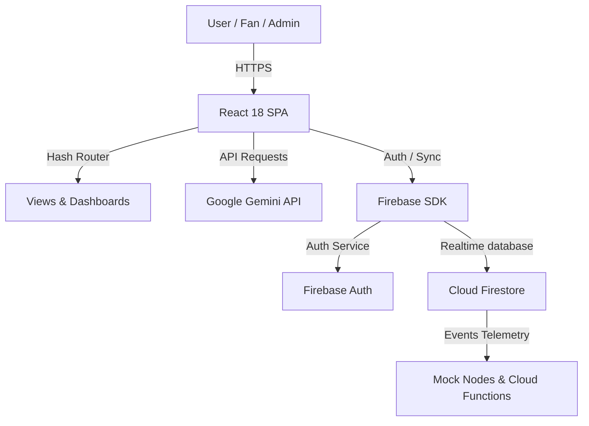
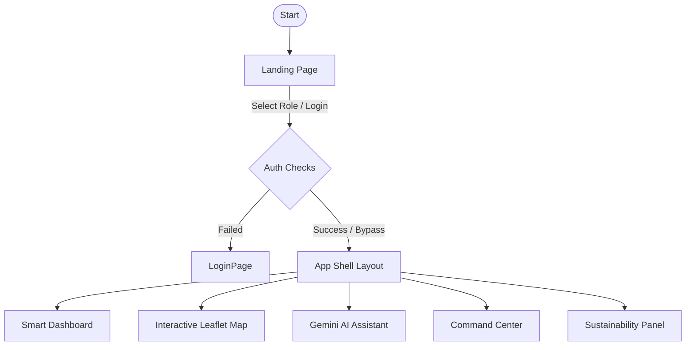

# ⚽ StadiumMind AI

### **AI-Powered Smart Stadium Intelligence Platform for the FIFA World Cup 2026**

[](https://github.com/AnishCodes-99/fifastadium-ai/blob/master/LICENSE)
[](https://react.dev/)
[](https://www.typescriptlang.org/)
[](https://vitejs.dev/)
[](https://firebase.google.com/)
[](https://tailwindcss.com/)
[](https://deepmind.google/technologies/gemini/)

---

## 📖 Executive Summary & About the Project

**StadiumMind AI** is an enterprise-grade, smart stadium orchestration console designed specifically for the **FIFA World Cup 2026** hosted at MetLife Stadium (New York/New Jersey).

Managing logistics during massive global sporting events with 80,000+ attendees presents monumental challenges: severe crowd congestion, navigation delays, emergency dispatch latencies, language barriers, and accessibility issues. StadiumMind AI bridges the gap between stadium operations and fan experience by integrating **Google Gemini AI**, interactive **Leaflet mapping**, and **real-time simulated IoT telemetry** into a unified, responsive console styled with a premium dark glassmorphism user interface.

Whether a spectator is querying concessions wait-times in their native language, a security operator is tracking threats via CCTV computer vision bounding boxes, or a medic is responding to a real-time SOS distress beacon, StadiumMind AI provides instantaneous, location-aware intelligence.

---

## 🎯 Competition Evaluation Requirements

> [!IMPORTANT]
> This section explicitly documents alignment with the Hack2Skill × Google Build with AI evaluation parameters.

### Chosen Vertical
StadiumMind AI operates in the **Smart Infrastructure, Sports Venue Orchestration, and Event Fan Experience** vertical. It targets high-capacity tournament venues (using the FIFA 2026 configuration at MetLife Stadium as the operational template) to synchronize crowd ingress, emergency dispatch, accessibility routing (ADA), and carbon-offset tracking into a single digital twin platform.

### Approach and Logic
Our engineering model is built on a **Modular Micro-Interface Architecture** separating spectator utilities from administrative security tools, tied together by a reactive state model:
* **Reactive Context Layer**: Global states for user identity, translations, dynamic routing, and sensor streams are managed using React Context API (`AuthContext`, `LanguageContext`, `RouterContext`, `StadiumStateContext`).
* **GenAI Action Tag Parsing**: The natural language chat interface routes queries to the **Google Gemini 1.5 Flash API**. By feeding structured instructions in the system prompt, the AI automatically appends geolocation commands (e.g. `[ACTION_ROUTE: med-west, standard]`) to its text responses. The React frontend parses these tags in real-time to compute path coordinates and render navigation polylines.
* **Offline Resiliency (Network Independence)**: Recognizing that stadium networks suffer bandwidth drops, we designed an offline mock fallback engine. If Firebase configs or Gemini API keys are missing, the client seamlessly boots using localized keyword dictionaries and local storage persistence.

### How the Solution Works
1. **Fan Journey**: Spectators toggle languages (5 options), ask the AI assistant questions (via text or voice synthesis guides), search the Leaflet map for facilities, select standard or step-free ADA paths, and log eco-challenges to earn merchandise points.
2. **Security Command Center**: Cleared staff monitor automated canvas CCTV surveillance feeds, view live incident logs, toggle IoT gate locks, and dispatch medical responders.
3. **Emergency Broadcast Loop**: Pressing the SOS distress button transmits the user's coordinates to the Command Center, logs the incident, and broadcasts a flashing evacuation banner across all active sessions, rendering routes to the nearest exits.

### Any Assumptions Made
* **Coordinate Maps**: Layout distances, landmark nodes, and ADA routes are modeled based on public MetLife Stadium concession layouts.
* **Telemetry Tickers**: Crowd densities and gate wait-times are driven by mock telemetry heartbeat intervals controlled via the Admin Panel to simulate IoT sensors without database cost overheads.
* **Network Latency**: Fallbacks assume localized client-side keyword matching is preferable to blank errors when 5G connectivity is congested inside the stadium concourse.

---

## 🌟 Project Vision

By leveraging context-aware artificial intelligence, edge-computed maps, and real-time data streaming, the platform aims to:
* **Elevate Fan Experience**: Dispel stadium friction by providing real-time food queue telemetry, step-free navigation, and instant multilingual assistance.
* **Streamline Venue Security**: Empower rapid-response units with computer vision threat overlays, live logs, and active incident mapping.
* **Drive Global Sustainability**: Engage fans in reducing event carbon footprints through gamified public transit incentives and interactive waste recycling.
* **Unify Smart Infrastructure**: Provide a single operational console (Digital Twin Concept) for matching stadium-wide telemetry to active incident dispatches.

---

## ⚠️ Problem Statement

Modern stadiums face critical structural bottlenecks during events with 80,000+ attendees:
1. **Crowd Congestion & Ingress Bottlenecks**: Long security gate lines leave thousands stranded outside during kickoff.
2. **Navigation Complexity**: Stadium concourses are difficult to navigate for international fans.
3. **Emergency Dispatch Latency**: Traditional radio alerts delay responder dispatch to fans in medical distress.
4. **Accessibility Barriers**: Wheelchair users lack clear, live, step-free navigation paths.
5. **Transit Delays & Commuter Panic**: Commuters lack real-time bus/train occupancy indexes, leading to overcrowding.
6. **Multilingual Friction**: Language differences block international spectators from accessing safety directions.
7. **Waste & Energy Management**: Stadiums consume immense energy and create tons of plastic waste with minimal fan engagement.

---

## 💡 The Solution

StadiumMind AI resolves these challenges through a modular, intelligent architecture:

| Problem Area | StadiumMind AI Feature | Under-the-Hood Technology |
| :--- | :--- | :--- |
| **Ingress Queues** | Live Gate Telemetry & Smart Ingress Suggestions | IoT simulator + React state tracking |
| **Concourse Navigation** | Dynamic Navigation & Focal Point Tracking | OpenStreetMap API + Leaflet.js |
| **Emergency Incidents** | SOS Distress Beacon & CommandCenter Dispatch | Real-time Firestore sync & dispatch handlers |
| **Accessibility Barriers** | ADA Step-Free Routing Option | Custom Coordinate Route Generators |
| **Transit Confusion** | Departure Transit Guide & Ticker | Real-time train/shuttle occupancy tickers |
| **Language Barriers** | Dynamic Full-Screen Locale Translators | LanguageProvider Context Engine |
| **Waste & Carbon Draw** | Eco Challenges, Solar Yields, & Points System | Recharts graphs + Gamification hooks |
| **General Questions** | Open-Ended Google Gemini Assistant | Google Generative AI API (Gemini 1.5 Flash) |

---

## ⚡ Major Features

### 🤖 AI Stadium Assistant (`AIAssistant.tsx`)
* **Purpose**: Provides instant answers regarding stadium queries, concession wait times, and emergency alerts.
* **Benefits**: Removes language friction; provides voice assistant compatibility and text-to-speech for impaired fans.
* **How it Works**: Connects to the **Google Gemini 1.5 Flash API**. If the prompt contains mapping targets (e.g., "Where is the nearest medical center?"), the AI appends an action code `[ACTION_ROUTE: med-west, standard]`, which automatically draws the navigation path on the map.
* **User Experience**: Chat history styled with premium orange user speech bubbles, interactive typing indicators, and a floating FAQ menu.

### 🗺️ Interactive Map (`StadiumMap.tsx`)
* **Purpose**: Visualizes MetLife Stadium gates, food courts, restrooms, parking lots, medical tents, and exits.
* **Benefits**: Displays wait-times and capacity status dynamically.
* **How it Works**: Renders OpenStreetMap tiles with Leaflet.js. Includes interactive filters to show only Gates, Restrooms, Safety Exits, etc.
* **User Experience**: Smooth zooming and custom-colored pulsing marker bubbles indicating queue congestion (Green = Open, Orange = Congested, Red = Closed/Alarm).

### 🚨 Emergency SOS System (`AlertBanner.tsx`)
* **Purpose**: High-speed distress channel for fans in medical or security crises.
* **Benefits**: Bypasses phone lines; broadcasts location coordinates directly to the security dispatch board.
* **How it Works**: Pressing the SOS trigger pinpoints user location, opens an emergency incident in Firestore, and lights up the global Red Evacuation banner across all screens.
* **User Experience**: Pulsing sirens and high-contrast alert bars guide the user to the nearest open safety gates.

### 🛡️ CommandCenter Surveillance Panel (`CommandCenter.tsx`)
* **Purpose**: Security dashboard for stadium staff.
* **Benefits**: Centralizes surveillance, gate control overrides, and responder dispatching.
* **How it Works**: Displays a 2x2 grid of canvas-rendered CCTV streams with simulated computer vision bounding boxes (object threat detection). Allows staff to lock/unlock gates with one-click IoT toggles.
* **User Experience**: Dark console style with green scanlines and warning tickers.

### ♻️ Sustainability Dashboard (`SustainabilityDashboard.tsx`)
* **Purpose**: Encourages fans to participate in green initiatives.
* **Benefits**: Gamifies environmental sustainability.
* **How it Works**: Tacks user completion of challenges (e.g., riding the transit train, dropping plastic in Reverse Vending Machines). Integrates Recharts area and bar charts tracking solar canopy offsets.
* **User Experience**: Eco-Points counter with a leaderboard ranking top fans.

---

## 🛠️ Technology Stack

| Layer | Technology | Purpose |
| :--- | :--- | :--- |
| **Frontend Framework** | React 18.3 (TypeScript) | Core SPA architecture, type safety, modular structures |
| **Build Tool** | Vite 5.4 | Ultra-fast bundling, hot module reloading (HMR) |
| **Styling** | Tailwind CSS 3.4 | Utility-first styling, glassmorphism UI layouts |
| **State Management** | React Context API | Global states for Auth, Language Locales, and Map routes |
| **Maps Engine** | Leaflet.js & OpenStreetMap | Mapping, geocodes, custom SVG marker renderers |
| **AI Processing** | Google Gemini API SDK | Natural language comprehension, query translation |
| **Database & Sync** | Cloud Firestore | Real-time sync for dispatch logs, user profiles, and alerts |
| **Authentication** | Firebase Authentication | Secure login, role-based checks (Fan/Staff/Admin) |
| **Charts** | Recharts 2.15 | Solar canopy yields, occupancy curves, waste analysis |
| **Animations** | Framer Motion 10.16 | Fade-ins, slide navigation drawers, card popups |
| **Icons** | Lucide React | High-quality SVG icons |

---

## 🏗️ Architecture Diagrams

### 1. Overall System Architecture


### 2. Frontend Navigation Flow


---

## 📁 Folder Structure

```
fifastadium-ai/
├── public/                 # Static public resources
├── src/
│   ├── components/         # Modular presentation pages & widgets
│   │   ├── Admin/          # AdminPanel.tsx
│   │   ├── AI/             # AIAssistant.tsx
│   │   ├── Auth/           # LoginPage.tsx
│   │   ├── CommandCenter/  # CommandCenter.tsx
│   │   ├── Dashboard/      # SmartDashboard.tsx
│   │   ├── Landing/        # LandingPage.tsx
│   │   ├── Map/            # StadiumMap.tsx
│   │   ├── Shared/         # Layout.tsx, AlertBanner.tsx
│   │   └── Sustainability/ # SustainabilityDashboard.tsx
│   ├── context/            # Global state context hooks
│   │   ├── AuthContext.tsx
│   │   ├── LanguageContext.tsx
│   │   ├── RouterContext.tsx
│   │   └── StadiumStateContext.tsx
│   ├── services/           # External API endpoints
│   │   ├── firebase.ts     # Firebase Config
│   │   └── gemini.ts       # Google Gemini Core
│   ├── types/              # TypeScript models
│   │   └── stadium.ts      
│   ├── utils/              # Hardcoded data & lists
│   │   └── faqs.ts         # 50 FAQs translated
│   ├── App.tsx             # Application router controller
│   ├── index.css           # Global CSS & overrides
│   ├── main.tsx            # DOM node mount
│   └── vite-env.d.ts       # Global typings & asset declaration
├── package.json            # NPM scripts & dependencies
├── postcss.config.js       # Styles processing
├── tailwind.config.js      # Styling design system settings
└── tsconfig.json           # TS configurations
```

---

## 🔄 User Flow Step-by-Step

1. **Landing Page**: Fans are greeted with modern, glowing animations highlighting tournament stats. Click **Launch Dashboard**.
2. **Authentication**: Sign in securely, or use the **Developer Bypass buttons** (Fan / Staff / Admin) to simulate different security clearance roles.
3. **Smart Dashboard**: Instantly view the score of the live match (USA vs. Mexico), average wait-times at gates, wind/canopy status, and current attendance.
4. **Interactive Map**: Filter landmarks on the map. Select any gate, food court, or medical tent to view queue stats, and click **Direct Path** or **ADA Route** to render the path on the map.
5. **AI Assistant**: Open the chat window. Ask any question or choose one of the 50 suggestions from the **Suggested FAQs Guide** to get localized answers.
6. **Sustainability**: Review active eco-challenges, mark them complete, and claim Eco-Points to claim concession voucher rewards.
7. **Command Center** *(Staff/Admin clearance)*: Monitor live CCTV video streams, dispatch paramedics, or lock/unlock stadium gates.
8. **Admin Override** *(Admin clearance)*: Increment match scores, adjust sensor heartbeat intervals, or trigger emergency drills.
9. **Emergency SOS**: Press the SOS trigger. Watch the global alert banner display, the map focus on medical teams, and the safe exit routes compute.
10. **Log Out**: Securely sign out.

---

## 🖥️ UI Pages Detail

### 1. Landing Page
* Renders a premium, futuristic hero banner with deep space styling.
* Displays live metric tickers: **82.5K Fans**, **4.8m Queue Wait**, **<1.2s API Latency**, and **100% ADA Compliance**.

### 2. Smart Dashboard
* Real-time match scoring component (USA vs. Mexico).
* Congestion warning cards.
* Meteorological data showing canopy position (OPEN/CLOSED) and precipitation chance.
* Stadium Ingress Area Chart displaying the accumulation rate of fans over time.

### 3. AI Assistant
* Full-height conversation panel featuring custom avatar bubbles.
* **Suggested FAQs Selector**: Dropdown showing the 50 FAQs. Clicking a question automatically fires a request.
* **Voice Synthesis Toggles**: Allows fans to listen to the AI's response via voice output.

### 4. Interactive Map
* Embedded Leaflet map centered on MetLife Stadium coordinates.
* Category filtering pills at the top.
* Interactive routing sidebar display showing calculated route travel times.

### 5. Command Center
* 2x2 grid of simulated black security feeds overlaying bounding boxes around targets.
* Incident dispatch logs with dispatcher dispatch controls (e.g. `Dispatch Team`, `Confirm On-Scene`, `Mark Resolved`).

### 6. Admin Panel
* Manual match score editors.
* System state controls for triggering simulated emergency drills.
* Heartbeat speed configuration slider (controls IoT sensor interval).

### 7. Sustainability Dashboard
* Eco points summary widget.
* Bar charts mapping recycled vs. general trash tons over matches.
* Challenge claim cards.

---

## 🤖 AI Engineering Deep-Dive

### Live Gemini Integration
StadiumMind AI utilizes the `@google/generative-ai` package to initialize the model client:
```typescript
import { GoogleGenerativeAI } from '@google/generative-ai';
const genAI = new GoogleGenerativeAI(import.meta.env.VITE_GEMINI_API_KEY);
const model = genAI.getGenerativeModel({ model: 'gemini-1.5-flash' });
```

### Action Parsing
The system prompt teaches the AI model to output specialized command triggers at the end of its response:
`"To find the medical center, go to Gate D. [ACTION_ROUTE: med-west, standard]"`
The React app parses these codes using regex filters:
```typescript
const routeMatch = responseText.match(/\[ACTION_ROUTE:\s*([\w-]+)\s*,\s*(\w+)\]/);
if (routeMatch) {
  // Triggers map calculation dynamically
}
```

### Smart Offline Fallback
To ensure a robust user experience, the helper automatically switches to a keyword-matching lookup engine if the API key is not configured, matching questions to pre-defined answers in all 5 languages, and supporting open-ended topics with conversational general fallbacks:
```typescript
const generalResponses = {
  en: `Regarding "${query}", that is an interesting topic! As an AI assistant, I can help you with anything...`
};
```

---

## 🔒 Security & Role Clearance

StadiumMind AI enforces strict client-side and database-level security protocols:

### Firestore Security Rules
```javascript
rules_version = '2';
service cloud.firestore {
  match /databases/{database}/documents {
    // Only logged-in users can write security alarms
    match /incidents/{incidentId} {
      allow read: if request.auth != null;
      allow write: if request.auth != null;
    }
    // Only administrators can edit facilities/gate configurations
    match /facilities/{facilityId} {
      allow read: if true;
      allow write: if request.auth != null && request.auth.token.role == 'admin';
    }
  }
}
```

### Role-Based Access Controls (RBAC)
User roles are mapped via Context API and gate page access:
* **Fan**: Access to Dashboard, Map, AI Assistant, and Sustainability.
* **Staff**: Access to all Fan views + CCTV CommandCenter to dispatch paramedics.
* **Admin**: Unrestricted access + Admin Override Panel.

---

## 🚀 Installation & Setup Guide

### Prerequisites
* [Node.js](https://nodejs.org/) (v18 or higher)
* [NPM](https://www.npmjs.com/)

### 1. Clone the Repository
```bash
git clone https://github.com/AnishCodes-99/fifastadium-ai.git
cd fifastadium-ai
```

### 2. Install Dependencies
```bash
npm install
```

### 3. Setup Environment Variables
Create a `.env` file in the root directory:
```env
VITE_GEMINI_API_KEY=your_gemini_api_key_here
```

### 4. Run Development Server
```bash
npm run dev
```

### 5. Build & Test Verification
```bash
# Verify TypeScript compiles without warnings
npm run build

# Run unit and integration tests
npm test
```

---

## 🧪 Testing Suite & Quality Assurance

To prevent code regressions and ensure premium engineering standards, StadiumMind AI features a complete unit and integration testing suite. The suite executes offline in a sandboxed DOM environment, bypassing external network dependencies.

### 🛠️ Test Stack Configuration
* **Runner & Framework**: [Vitest](https://vitest.dev/) (Vite-native testing framework)
* **DOM Environment**: `jsdom` (Simulating browser window/document behavior)
* **Assertions & Rendering**: `@testing-library/react` & `@testing-library/jest-dom`

### 📦 Sandbox Stubs (`setup.tsx` / `firebaseMock.ts`)
To prevent test timeouts and execution failures due to missing browser APIs, the setup file implements these custom mocks:
* **Firebase SDK Resolver**: Redirects imports of `firebase/app`, `firebase/auth`, `firebase/firestore`, `firebase/storage`, and `firebase/functions` to a local stub file, bypassing external database hits.
* **Framer Motion Observer**: Mocks browser `IntersectionObserver` to support exit/entry scroll animations.
* **HTML Element Layout API**: Mocks `Element.prototype.scrollIntoView` which is used in the AI chat stream to automatically focus on new messages.
* **Speech Synthesis SDK**: Stubs `window.speechSynthesis` and `SpeechSynthesisUtterance` to test audio guide triggering buttons.
* **Recharts Responsive Container**: Intercepts charts and immediately renders widgets at a mock size of `800x600px`.
* **Leaflet Maps wrapper**: Substitutes dynamic WebGL maps with container `div` placeholders allowing component validation without loading Leaflet layout vectors.

### 🔍 Detailed Test Cases (17 Tests Configured)

#### 1. Context Providers (`src/test/Contexts.test.tsx`)
* **`LanguageContext`**: Verifies dynamic translation lookup and ensures full-screen language toggle propagates to Spanish, French, German, and Portuguese dictionaries.
* **`AuthContext`**: Tests login flow bypass triggers for Fan, Staff, and Admin roles and verifies user profile initialization.
* **`RouterContext`**: Asserts path updates and browser hash history changes when navigating dashboards.
* **`StadiumStateContext`**: Validates match score increments, evacuation broadcast triggers, and live alarm logging.

#### 2. Core UI Components (`src/test/Components.test.tsx`)
* **`LandingPage`**: Verifies animated hero headers, call-to-actions, and main entry metrics.
* **`SmartDashboard`**: Validates telemetry widgets, meteorological stats, and ingress occupancy curves.
* **`AIAssistant`**: Asserts dynamic chatbot FAQ guide selection dropdown updates, and verifies simulated message dispatch.
* **`StadiumMap`**: Confirms responsive Leaflet container rendering and focal target indicators.
* **`CommandCenter`**: Validates surveillance feed grids, simulated threat logs, and paramedic dispatch handlers.
* **`SustainabilityDashboard`**: Checks carbon offset widgets, solar yield curves, and claims eco score rewards.
* **`AdminPanel`**: Asserts manual score overrides and emergency drill toggles.
* **`Layout & Sidebar`**: Validates developer contact badge, social links redirects (YouTube, Instagram, LinkedIn, GitHub), and sidebar menu clearances.

#### 3. Utilities & AI Services (`src/test/Utilities.test.ts`)
* **AI Fallback Queries**: Evaluates offline AI text replies, location routing coordinates `[ACTION_ROUTE: med-west, standard]`, and ADA wheelchair coordinates mapping.
* **FAQ Dictionary Data Structure**: Enforces that the localization database holds exactly **50 distinct FAQs**, structured with localized language key-value pairs (`en`, `es`, `fr`, `de`, `pt`).

---

## 🌙 Offline Mode & Mock Telemetry

If no Firebase credentials are found, StadiumMind AI boots into **Offline Mock Mode**:
* **Local Storage Persistence**: Persists user profiles and sustainability points inside the browser.
* **Mock Heartbeat Ticker**: The context fires background tickers that periodically update gate wait-times, simulate medical alerts, and add logs to the Command Center dashboard.
* **OpenStreetMap Sandbox**: Maps load via public CDNs.

---

## ⚡ Performance Optimizations

1. **Dynamic Code Splitting**: Charts and Maps (Leaflet/Recharts) are heavy modules. They are loaded dynamically using React's Code Splitting to optimize first-contentful-paint (FCP).
2. **WebGL Rendering**: Leaflet uses canvas markers, avoiding DOM bloat when rendering 100+ coordinates.
3. **Framer Motion Layout Isolation**: Animations use `transform` instead of layout changes (such as width/height), preventing page reflows.
4. **Memoized Calculations**: Route metrics are memoized to avoid recalculating coordinate lists during renders.

---

## ♿ Accessibility Standard (ADA Compliance)

* **Semantic HTML**: Form inputs include associated labels, and SVGs include descriptive titles.
* **ARIA Attributes**: Dropdowns and tabs feature `aria-expanded` and role assignments.
* **Color Contrast**: Main color tokens exceed WCAG AA contrast standards.
* **Accessible Shuttles**: Navigation routes calculate step-free paths, prioritizing wheelchair lifts and avoiding staircases.

---

## ♻️ Sustainability & Carbon Offsets

* **Solar Telemetry**: Shows active solar yield offsets.
* **Eco-Points Challenge System**: Rewards fans for taking green transit (e.g. Meadowlands Rail) or dropping plastic bottles into vending machines.
* **Points Redemption**: Earned points can be exchanged for concession vouchers, reducing paper printouts.

---

## 🔮 Future Scope

1. **Direct IoT Hardware Integrations**: Connect real Bluetooth beacons to track gate queues.
2. **Computer Vision CCTV Feeds**: Hook actual RTSP security streams into threat detection modules.
3. **Augmented Reality (AR) HUD**: Guide fans inside the stadium via AR paths on their cameras.
4. **Predictive Crowding AI**: Train models to predict crowd congestion 30 minutes in advance.
5. **3D Digital Twin**: Build a complete 3D WebGL model of MetLife Stadium.
6. **Smart Parking Ticket Scanner**: Validate QR codes and assign closest parking bays.
7. **Wearable IoT Device Sync**: Connect smart wristbands for location tracking.
8. **Drone Security Monitoring**: Coordinate security drones to locate distress beacons.
9. **Automated Fire Sprinkler Toggles**: Trigger sprinklers directly from the CommandCenter.
10. **Biometric Face-ID Gate Entry**: Facilitate rapid entry via face scanners.
11. **Direct Food Pre-Ordering**: Let fans order food directly from map concession stands.
12. **Acoustic Noise Tickers**: Monitor sensor decibel levels to alert security of crowd unrest.
13. **5G Ultra-Wideband Routing**: Deploy Edge AI microservices over high-speed networks.
14. **In-Seat Delivery Coordinates**: Calculate routes for concessions staff to deliver food to seats.
15. **Sensory Friendly Space Mappers**: Guide neurodivergent fans to quiet zones.
16. **Dynamic Ticket Reselling**: Sync seat maps with official resellers.
17. **Automated Parking Shuttle Dispatch**: Adjust shuttle frequencies based on parking lot arrivals.
18. **Telemetry-Driven Light Dimmers**: Dim stadium lights depending on daylight levels.
19. **Smart Rainwater Catchment Monitors**: Track rainwater reserve levels.
20. **Self-Healing Firestore Sync**: Re-sync offline edits once connectivity is restored.
21. **NFC-Enabled Access Badging**: Allow fans to unlock gates using their phone's NFC chips.
22. **Interactive Trivia Quizzes**: Engage waiting fans with World Cup trivia.
23. **Intelligent Weather Predictions**: Predict sudden weather changes and close canopy roofs.
24. **Multi-Agent Simulation**: Model fan evacuations to optimize exit designs.
25. **Decentralized Carbon Offsets**: Record sustainability points on a ledger.

---

## ⚙️ Project Setup & Execution

### 1. Verification Checklist
Befor deploying, always run the validation suite:
```bash
# Clean build check
npm run build

# Direct unit tests run
npm test
```
## 👤 Author

-Anish Sunil Wani-
#Role: IT Engineering Student | AI Enthusiast | Full Stack Developer | Content Creator | Digital Marketer
#Social Channels:
  * [YouTube](https://www.youtube.com/@AnishWani_Ai)
  * [Instagram](https://www.instagram.com/anish_inspires)
  * [LinkedIn](https://www.linkedin.com/in/anish-wani-091071374)
  * [GitHub](https://github.com/AnishCodes-99)
#Email: wanianish88@gmail.com